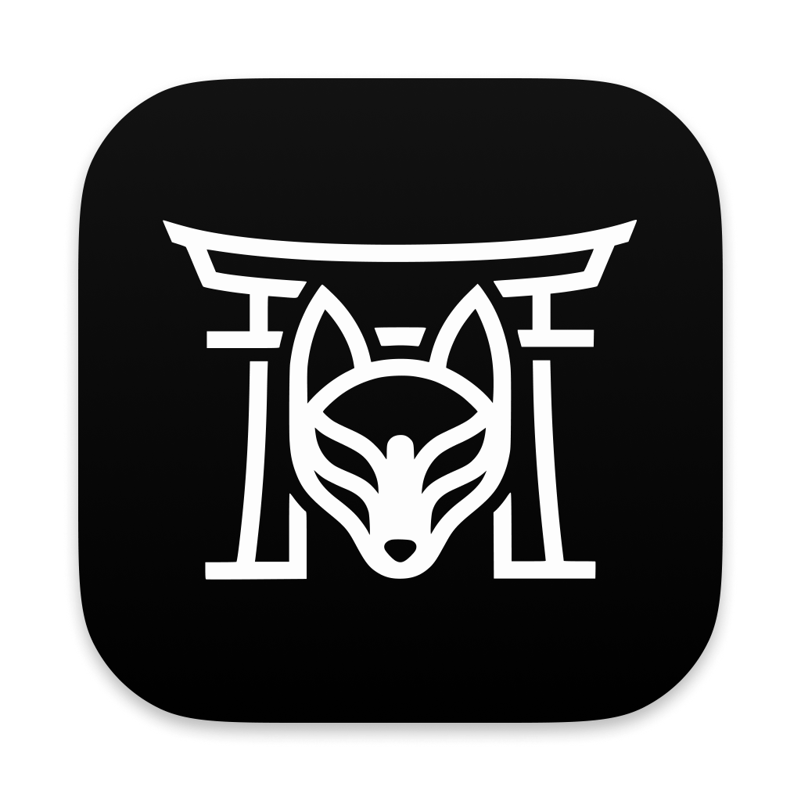
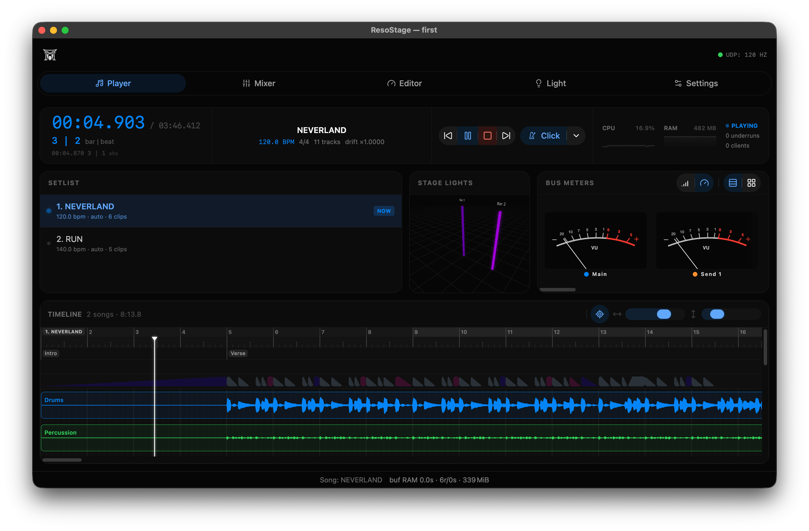
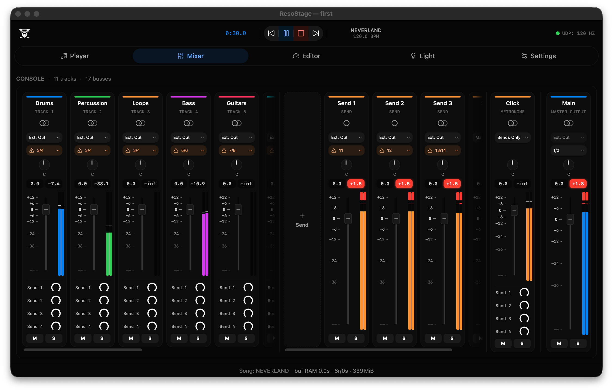
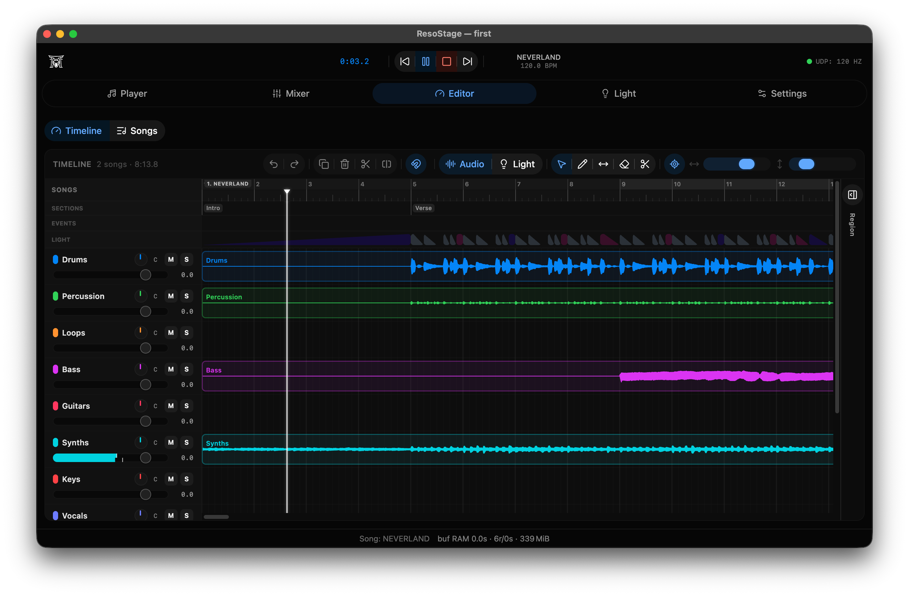
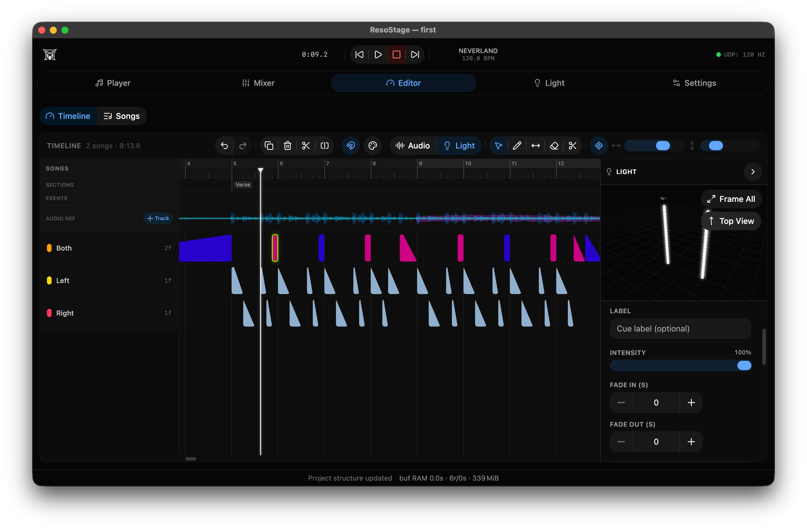
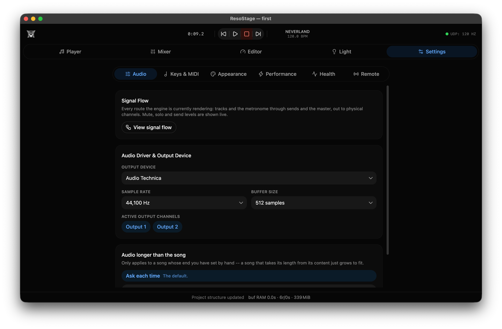
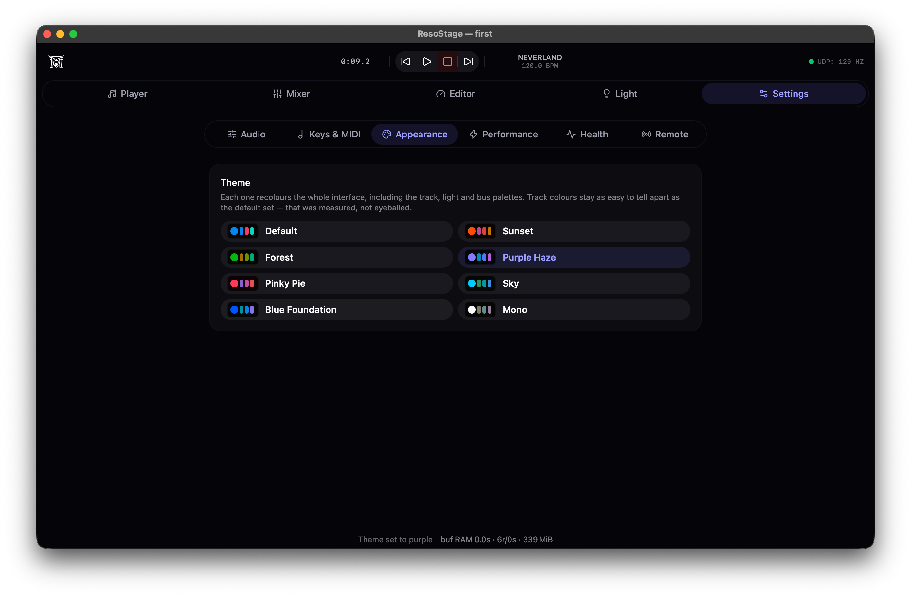

<p align="center">
  
</p>

<h1 align="center">ResoStage</h1>

<p align="center">
  <strong>Deterministic real-time live performance workstation combining a sample-accurate digital audio engine, multi-protocol stage lighting automation, and 3D stage visualizer.</strong>
</p>

<p align="center">
  <a href="LICENSE"></a>
  
  
  
  
  
  <a href="#-public-beta-physical-dmx--sacn--art-net-hardware-testing"></a>
  <a href="https://github.com/sponsors/resonaura"></a>
  <a href="https://buymeacoffee.com/resonaura"></a>
</p>

<p align="center">
  
</p>

---

## Overview

**ResoStage** is a cross-platform live performance workstation engineered for touring bands, live electronic performers, and stage technicians who need guaranteed zero-dropout multitrack playback synchronized with automated lighting fixtures.

Most DAWs are built for studio production: they are loaded with heavy graphic pipelines, non-deterministic plugin chains, complex menus, and cloud DRM licensing checks that risk failing on stage. DIY stage playback rigs, on the other hand, often consist of fragile scripts bridging separate audio players, MIDI clock generators, and lighting consoles.

ResoStage bridges this divide with a unified, high-reliability architecture:
- A **native C++20 / JUCE 9 audio core** executing strict zero-heap-allocation callbacks.
- A **native process supervisor (`kaishaku`)** that isolates the user interface from the audio engine, ensuring audio never drops even if the UI crashes.
- A **real-time 60 Hz lighting automation engine** outputting synchronized DMX-512, Art-Net, sACN (ANSI E1.31), and direct ESP32 addressable LED strip packets.
- An **interactive 3D stage visualizer** powered by Three.js and WebGL.
- A **local Wi-Fi remote control** interface allowing musicians and FOH engineers to monitor and adjust mixes from phones or tablets on the same venue network.

---

> [!IMPORTANT]
> ### 📢 Public Beta: Physical DMX / sACN / Art-Net Hardware Testing
> The stage lighting subsystem is implemented according to ANSI E1.31 (sACN), Art-Net, and DMX-512 specifications, and is actively seeking community validation on real stage hardware.
>
> If you have physical moving heads, LED bars, USB-DMX interfaces (FTDI / Enttec), or Art-Net/sACN Ethernet nodes, please test ResoStage in your rehearsal space or concert venue! Feedback, packet captures, and issue reports from real physical rigs are warmly welcomed via [GitHub Issues](https://github.com/resonaura/resostage/issues).

---

## Key Highlights

- **Zero-Allocation Audio Thread**: Strict zero-heap-allocation policy inside the real-time audio callback (`processBlock`). All voice structures, mixing nodes, and stem buffers are pre-allocated at song initialization.
- **Sample-Accurate Sinc Resampling**: Precomputed 64-point Kaiser-windowed Sinc interpolator handles pitch shifting and tempo variations with harmonic aliasing suppression while consuming under 2% CPU per voice at 96 kHz.
- **Lock-Free Concurrency**: Audio threads communicate with background workers and disk streamers via lock-free Single-Producer Single-Consumer (SPSC) ring buffers and atomic memory fences. System calls and mutex locks never enter the audio rendering path.
- **Kaishaku Process Supervision**: Independent native supervisor daemon monitors IPC heartbeats. If the graphical interface ever terminates or stalls, the audio engine continues rendering audio uninterrupted while `kaishaku` relaunches the UI and restores active playback state within 300 ms.
- **Adaptive Disk I/O Pressure Management**: Multitrack streams pull from ring buffers monitored by an adaptive read-ahead policy. If disk read stalls occur on slow USB drives, the engine automatically expands read-ahead windows before starvation can reach the DAC.
- **Hardware Lighting Control**: Outputs synchronized 60 Hz fixture control packets across DMX-512, Art-Net, and sACN (ANSI E1.31) over UDP, plus a custom binary protocol driving networked ESP32 microcontrollers with per-pixel gamma correction.
- **Interactive 3D Stage Visualizer**: Real-time 60 FPS WebGL scene powered by Three.js, rendering stage trusses, moving head fixture orientations, and volumetric light cones.
- **Zero Subscriptions & Zero Telemetry**: Offline-first design built for real concert environments. No internet connection required during soundcheck or showtime.

---

## User Interface Tour

### 1. Live Player & Transport
Dedicated performance screen featuring large, high-visibility timecode and bar/beat counters, song setlist management, transport controls, visual click track, system telemetry (CPU, RAM, buffer underrun counter), dual VU bus meters, and a real-time 3D stage preview.

<p align="center">
  
</p>

### 2. Multitrack Live Mixing Console
Console designed for rapid soundcheck balance adjustments. Features per-stem faders, physical output channel assignment matrix (e.g. outputs 1/2 for master PA, 3/4 for in-ear monitors, 5/6 for bass, 7/8 for click), send buses, and true peak metering.

<p align="center">
  
</p>

### 3. Multitrack Waveform & Section Editor
Timeline editor providing waveform views for all stems (Drums, Percussion, Loops, Bass, Guitars, Synths, Keys, Vocals), song sections (Intro, Verse, Chorus), markers, regions, and audio reference tracks.

<p align="center">
  
</p>

### 4. Stage Lighting & Cue Automation Sequencer
Timeline automation for lighting fixtures synchronized to audio transport ticks. Group fixtures into Left, Right, or Stage-wide arrays, draw decay slopes and color pulses, adjust fade in/out parameters, and preview lighting moves live in the 3D stage inspector.

<p align="center">
  
</p>

### 5. Audio Engine, Driver & Routing Configuration
Low-latency hardware driver configuration supporting CoreAudio (macOS), ASIO and WASAPI (Windows), and ALSA/JACK/RTKit (Linux). Configurable sample rates (44.1 kHz to 192 kHz), hardware buffer sizes (64 to 2048 samples), and interactive signal flow routing diagrams.

<p align="center">
  
</p>

### 6. Calibrated Stage Appearance Themes
High-contrast color palettes specifically measured and tuned for legibility in dark venues, outdoor daylight, and under bright stage lighting rigs (*Default, Sunset, Forest, Purple Haze, Pinky Pie, Sky, Blue Foundation, Mono*).

<p align="center">
  
</p>

---

## Technical Architecture

```
┌──────────────────────────────────────────────────────────┐
│                   Electron / React 19                    │
│      Three.js 3D Visualizer  •  Timeline  •  Mixer       │
└──────────────┬────────────────────────────▲──────────────┘
               │ Local WebSocket IPC        │
               ▼                            │ State Broadcast
┌───────────────────────────────────────────┴──────────────┐
│                 Native Supervisor (Kaishaku)             │
│            Heartbeat Watchdog  •  Auto-Recovery          │
└──────────────┬────────────────────────────▲──────────────┘
               │ SPSC Lock-Free Ring Buffers│ Shared Memory
               ▼                            │
┌───────────────────────────────────────────┴──────────────┐
│              C++20 / JUCE 9 Audio Core                   │
│   Zero-Alloc Audio Callback  •  Sinc Resampler (Kaiser)  │
│   Multitrack Stem Engine     •  60Hz DMX/sACN/Art-Net    │
└──────────────────────────────────────────────────────────┘
```

### Real-Time Audio Engine (C++20 / JUCE 9)
Audio processing runs on a dedicated high-priority thread isolated from the operating system UI scheduler. The audio callback operates under a strict zero-heap-allocation policy: all buffers, mix graphs, and voice states are pre-allocated during project initialization.

- **Sample-Accurate Resampling**: Pitch-shifting and time-stretching run through a precomputed 64-point Kaiser-windowed Sinc interpolator. This eliminates harmonic aliasing while keeping CPU overhead below 2% per voice at 96 kHz.
- **Lock-Free Concurrency**: Audio threads communicate with background workers using single-producer single-consumer (SPSC) lock-free ring buffers and atomic state flags. Mutex locks and system calls never enter the rendering path.
- **Disk I/O Pressure Management**: Multitrack audio streams pull from background ring buffers monitored by an adaptive I/O pressure policy. If disk read stalls occur on slow external drives, the engine expands read-ahead windows before starvation can hit the DAC.
- **Thread Scheduling**: The engine requests real-time OS privileges on startup (`AudioUnit` high-priority workgroups on macOS, `THREAD_PRIORITY_TIME_CRITICAL` on Windows, and `SCHED_FIFO` via RTKit on Linux).

### Process Supervision & Crash Isolation (Kaishaku)
Live performance software cannot drop audio if a graphic render stalls or an Electron window crashes. ResoStage isolates the interface from the audio core using a native supervisor daemon named `kaishaku`.

- The supervisor runs as an independent OS process linked to the audio engine and UI shell through local IPC heartbeat channels.
- If the graphical interface terminates unexpectedly, the audio engine continues playback without interruption.
- `kaishaku` restarts the interface process and repopulates the active project state within 300 milliseconds.

### Stage Lighting & Hardware Protocols
The lighting subsystem generates and transmits fixture control data at a steady 60 Hz refresh rate, synchronized to audio transport ticks and musical tempo maps.

- **DMX-512**: Serial output via FTDI / USB-DMX interfaces with hardware break timing control.
- **Art-Net & sACN (ANSI E1.31)**: Multicast and unicast UDP packet transmission across multiple universes, supporting moving heads, strobes, and LED bars.
- **Resolight ESP32 Protocol**: Custom binary UDP protocol communicating directly with networked ESP32 microcontrollers running custom firmware (`resolight/firmware`). It drives addressable WS2812B and SK6812 LED strips with per-pixel gamma correction.

### 3D Stage Visualizer & Interface
The frontend runs inside Electron using React 19 and Three.js.

- **Real-Time WebGL Rendering**: Renders full 3D stage setups, truss structures, moving head fixtures, and volumetric light cones.
- **Synchronized Playback**: The 3D viewport updates at 60 frames per second using state broadcasts from the C++ core over local WebSocket connections.
- **Touch & Hardware Control**: Supports bi-directional MIDI control surfaces with motorized fader feedback and touch-friendly live operation layouts.

---

## Installation & Getting Started

### macOS Installation & Gatekeeper Note

ResoStage is an independent open-source project distributed directly to musicians and engineers without an Apple Developer ID certificate ($99/year). Because the application binaries are not notarized by Apple, macOS Gatekeeper may present a warning dialog on first launch (*"ResoStage is damaged and can't be opened"* or *"Cannot open because developer cannot be verified"*).

To remove the macOS quarantine attribute:

#### Option 1: Terminal Command (Instant)
Run the following command in Terminal after copying `ResoStage.app` to your Applications folder:
```bash
xattr -cr /Applications/ResoStage.app
```

#### Option 2: Finder Right-Click
1. In Finder, open `/Applications` and locate `ResoStage.app`.
2. **Right-click (or Control-click)** the app icon and select **Open**.
3. In the confirmation prompt, click **Open Anyway**. macOS will remember this exception permanently.

#### Homebrew (Planned Tap)
```bash
brew tap resonaura/tools
brew install --cask resostage
```

---

## Building from Source

### Prerequisites

- C++20 compliant compiler (Clang 16+, GCC 13+, or MSVC 2022)
- CMake 3.28+
- Node.js 20+ and pnpm 10+
- Ninja build system

### 1. Build Native Audio Engine

```bash
# Configure CMake
cmake -B core/build -S core -G Ninja -DCMAKE_BUILD_TYPE=Release

# Compile binaries
cmake --build core/build --config Release

# Run automated tests
ctest --test-dir core/build --output-on-failure
```

### 2. Build Frontend & Desktop Application

```bash
# Install dependencies
pnpm install

# Start development environment (core engine + web UI)
pnpm dev

# Package production application
pnpm build:app
```

---

## 📄 License & Open Source Philosophy

ResoStage is licensed under the **[GNU General Public License v3.0 (GPLv3)](LICENSE)**.

### 🎵 The Live Stage Guarantee
- **100% Free & Open Source for the Stage**: The core audio engine, multitrack playback, local mixing console, DMX/Art-Net/sACN lighting engine, 3D visualizer, and local Wi-Fi remote control are completely free and open source.
- **No Subscriptions, No Telemetry, No Online Activation**: A concert tool must be rock-solid offline. ResoStage will never require an internet connection on stage.
- **GPLv3 / JUCE Ecosystem**: ResoStage is built on JUCE and honors the open-source spirit of the audio DSP developer community.

### 🌐 Cloud & Multi-City Collaboration Roadmap
Stage-floor and local venue operation will always remain 100% free and open source.

In the future, extended remote collaboration features requiring dedicated managed server infrastructure (such as global NAT traversal / TURN relay clusters for streaming rehearsals between different cities, cloud session backups, and distributed access management) will be introduced as an optional hosted cloud service tier.

---

## Author & Support

Created and maintained by **Andrii Vynohradov ([@resonaura](https://github.com/resonaura))**.

- **Personal Portfolio**: [vynohradov.ca](https://vynohradov.ca) • [rsnra.link](https://rsnra.link)
- **LinkedIn**: [linkedin.com/in/resonaura](https://linkedin.com/in/resonaura)
- **Email**: [andrii.vynohradov@gmail.com](mailto:andrii.vynohradov@gmail.com)

If you find ResoStage useful for your concerts, rehearsals, or live rigs, consider supporting ongoing development:

[](https://github.com/sponsors/resonaura)
[](https://buymeacoffee.com/resonaura)
