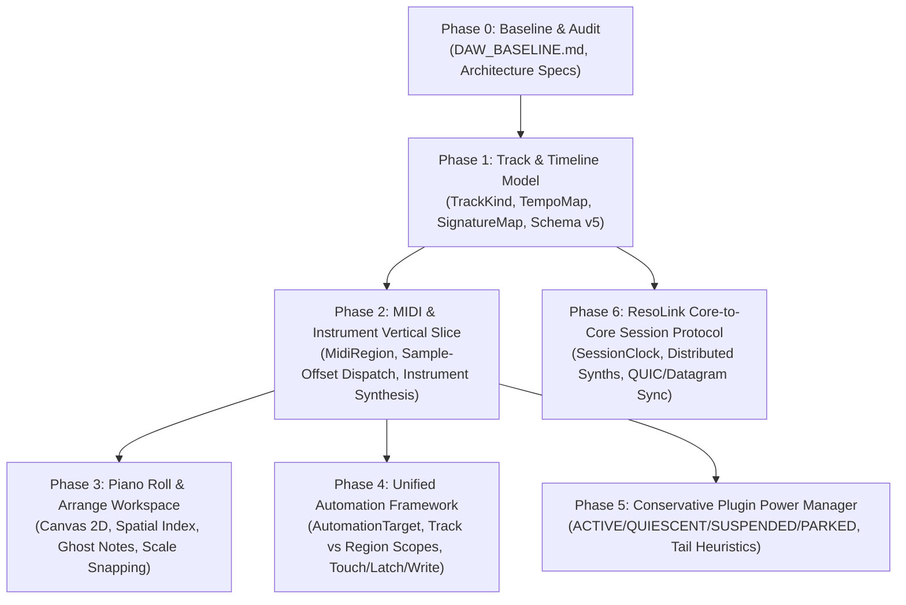

# ResoStage Live-First DAW: Implementation Plan & Phase Dependency Graph

This document defines the formal phased roadmap for evolving ResoStage into a professional live-first DAW platform. Each phase has concrete acceptance criteria, required tests, benchmarks, and strict real-time boundaries.

---

## 1. Phase Dependency Graph

---

## 2. Phase Breakdown & Acceptance Criteria

### Phase 0: Baseline & Architectural Charter
- **Status**: `VERIFIED`
- **Deliverables**:
  - `docs/ai/CURRENT_TASK.md`
  - `docs/performance/DAW_BASELINE.md`
  - `docs/architecture/DAW_TRACK_MODEL.md`
  - `docs/architecture/MIDI_AND_PIANO_ROLL.md`
  - `docs/architecture/AUTOMATION_MODEL.md`
  - `docs/architecture/PLUGIN_POWER_MANAGEMENT.md`
  - `docs/architecture/RESOLINK_PROTOCOL.md`
- **Acceptance Criteria**: Baseline measurements recorded, test suites 100% green, architectural contracts established.

---

### Phase 1: Track & Timeline Model Generalization
- **Status**: `IN_PROGRESS`
- **Scope**:
  - `ProjectSchema.h` & `ProjectLoader`:
    - Extend `TrackDef` with `TrackKind kind = TrackKind::Audio` (`Audio`, `Instrument`, `MIDI`, `ExternalMIDI`, `Lighting`, `Folder`, `BusTimeline`).
    - Decouple `track.id` from `stripId`: add `std::string stripId` (defaulting to `track.id`).
    - Add `MidiNote` (`pitch`, `startBeats`, `durationBeats`, `velocity`, `releaseVelocity`, `probability`).
    - Add `MidiRegion` (or generalized `Region` supporting audio resources and inline MIDI note buffers).
    - Introduce immutable, versioned `TempoMap` and `SignatureMap` with $O(\log N)$ binary search and cached beat-to-seconds conversion.
  - Backwards Compatibility:
    - On-disk schema format remains readable; lossless promotion of v4 format into memory.
- **Acceptance Criteria**:
  - Existing projects load identically without changes to audio playback.
  - Unit tests verify conversion between musical beat position and timeline seconds across tempo changes.
  - Zero heap allocation in realtime beat-to-time projection.

---

### Phase 2: MIDI & Instrument End-to-End Vertical Slice
- **Status**: `PROPOSED`
- **Scope**:
  - Track with `TrackKind::Instrument` hosts instrument plug-in.
  - MIDI regions with `MidiNote` events sound during playback.
  - In `AudioEngineTransport.cpp` / `fireDueEvents`: convert timeline `MidiNote` within active block into `juce::MidiMessage` with exact sample offsets.
  - `PluginProcessorBank::processChain` delivers MIDI buffer to instrument node -> synthesizes audio into track scratch -> runs subsequent audio effect inserts -> mixes into strip -> sends -> master.
  - Offline renderer produces identical stem/main audio output for instrument tracks.
- **Acceptance Criteria**:
  - C++ unit & integration tests verify sample-accurate MIDI dispatch, note-on/note-off block boundaries, chords, polyphony, and offline render equivalence.

---

### Phase 3: Piano Roll & Arrange Workspace (UI)
- **Status**: `PROPOSED`
- **Scope**:
  - Dual workspace architecture: **Live Workspace** (show-first) vs **Arrange Workspace** (linear DAW timeline).
  - High-performance Canvas 2D Piano Roll with spatial index (`RTree` / grid buckets):
    - Zero React component overhead per note (rendering 50,000+ notes smoothly at 60 FPS).
    - Note operations: draw, erase, marquee select, drag move, drag resize, clone, velocity edit lane.
    - Scale snapping & scale highlighting.
    - Ghost notes from other tracks (selectable & editable).
- **Acceptance Criteria**:
  - Mouse drag moves notes without whole-project serialization or React render cascades.
  - Benchmarks prove < 16 ms frame render time under 10,000 notes.

---

### Phase 4: Unified Automation Framework
- **Status**: `PROPOSED`
- **Scope**:
  - Stable `AutomationTarget`:
    - `Domain`: Mixer, Plugin, MidiCC, Lighting.
    - `EntityId`: target strip or track ID.
    - `ParameterId`: parameter index or name.
    - `ValueKind`: continuous, discrete, enum.
  - Scopes:
    - `TrackAutomation`: locked to global timeline.
    - `RegionAutomation`: moves and copies with region.
    - `RegionModulation`: relative modulation envelope.
  - Core Evaluator:
    - Real-time block evaluation using `AutomationEnvelope` curvature with shape preservation.
    - Bounded $O(\text{active segments})$ computation without scans.
  - Write modes: `Read`, `Touch`, `Latch`, `Write`.
- **Acceptance Criteria**:
  - Automation tests verify live/offline parity, boundary conditions, and zero audio callback allocations.

---

### Phase 5: Conservative Plugin Power Manager
- **Status**: `PROPOSED`
- **Scope**:
  - Subsystem `PluginPowerManager` with state machine:
    `ACTIVE` -> `QUIESCENT` -> `SUSPENDED` -> `PARKED`.
  - Lookahead / prewarming horizon calculated from measured wake times.
  - Guard conditions preventing suspension: record armed, input monitoring, active live MIDI, signal generator, active reverb/delay tail, approaching automation.
  - Safe failure policy: if prewarm misses deadline, callback emits silence or bypasses without audio dropouts or blocking locks.
- **Acceptance Criteria**:
  - Plugins with tails ring out completely; silence-skipping does not cut off infinite tails or generators.
  - Stress tests verify zero audio thread stalls during plugin parking/waking.

---

### Phase 6: ResoLink Core-to-Core Session Protocol
- **Status**: `PROPOSED`
- **Scope**:
  - Core-to-Core network session protocol:
    - Roles: Conductor (Project Authority) and Renderers (Instrument / Playback / Lighting).
    - Versioned `SessionClock` anchors linking session monotonic time, local monotonic time, local audio sample position, and musical beats.
    - Distributed tracks: Conductor transmits timestamped MIDI events ahead of deadline to Peer; Peer synthesizes audio on local hardware.
    - Wire format documentation (`RESOLINK_WIRE_FORMAT.md`, `RESOLINK_STATE_MACHINE.md`).
    - Explicit failure states (`SYNCED`, `DEGRADED`, `STALE`, `DISCONNECTED`, `RESYNCING`).
- **Acceptance Criteria**:
  - Two-machine integration test: Conductor plays project, Peer receives MIDI and renders instrument in real time without audio glitches.
  - Network loss does not freeze Conductor or Peer audio callback.
